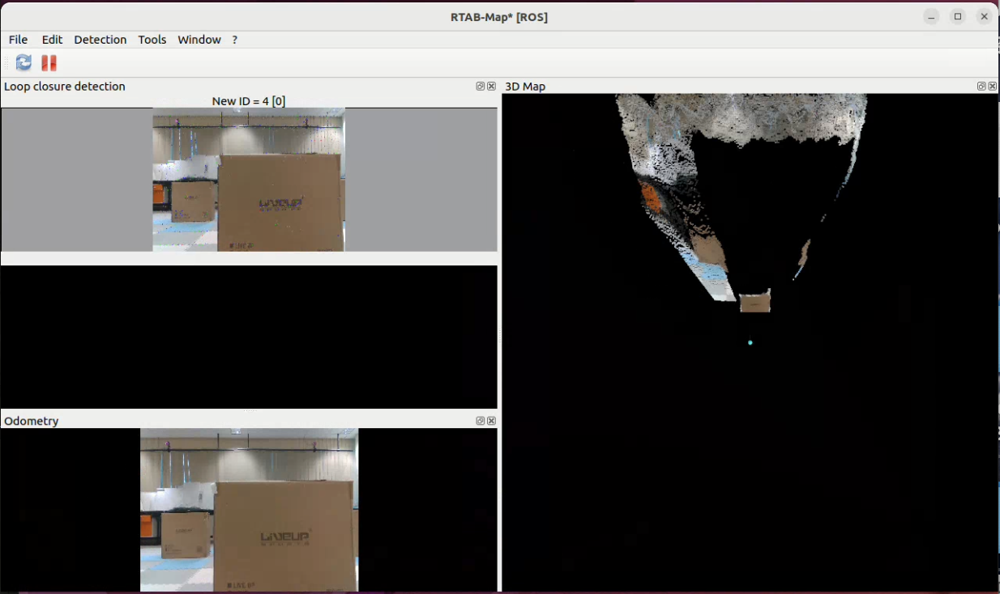
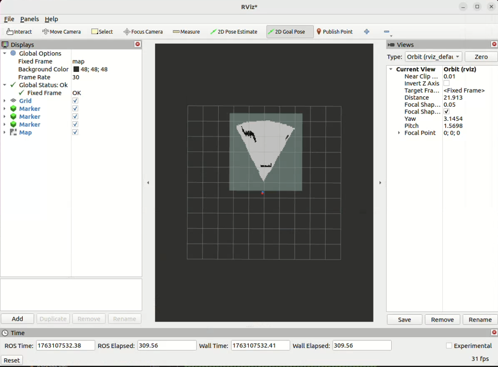

# 🦾 基于 Intel RealSense D435i 与 RTAB-Map 的 Unitree Go2 建图与导航系统（ROS 2 Humble）

本项目构建了一个完整的 四足机器人建图 + 定位 + 路径规划导航系统，基于：
Intel RealSense D435i（RGB-D + IMU）
Unitree Go2
RTAB-Map RGB-D SLAM
A*全局路径规划
ROS 2 Humble（Ubuntu 22.04）
系统提供了稳定的 建图、定位、路径规划、避障与 TF 关系管理，并可直接部署到 Unitree Go2 进行真实环境验证。 

系统通过对 **深度相机与机器人内置里程计的时间同步** 与 **TF 坐标配置优化**，成功实现了在复杂环境下的 **稳定建图与精确定位**。

---

## 🚀 一、项目简介

本项目的主要目标是让 **Unitree Go2** 机器人能够利用 **Intel RealSense D435i** 相机进行 **实时环境感知与地图构建**。  
系统成功解决了 RTAB-Map 常见的“相机数据与里程计时间戳不匹配”问题，实现了流畅的 SLAM 映射过程。  

经过优化的 TF 树、可靠的 QoS 配置以及多源数据同步机制，使机器人能在实际环境中进行连续、稳定的建图和导航。

项目成果展示视频：

---

## 🧩 二、功能特点

🔍 SLAM（建图 & 定位）
RGB-D + IMU 输入（RealSense D435i）
RTAB-Map 实时建图 & 回环检测
发布 2D OccupancyGrid + 3D OctoMap
稳定的 TF 树：
map → odom → base_link → camera_link → camera_color_optical_frame
解决 RealSense 时间戳不同步问题

🚙 机器人运动与姿态
订阅 Unitree Go2 里程计 /utlidar/robot_odom
自带 /robot_odom_fixed 时间戳修复机制
实现 RTAB-Map 与 Unitree odom 的稳定融合

🗺 路径规划（A* Algorithm）
基于 RTAB-Map 发布的 占据栅格图
全局规划（Python 实现）自动避开障碍物
输出优化后的全局路径（Path msg）

🎯 轨迹跟随（Pure-Pursuit）
实现 前视距离追踪算法
自动计算局部目标点
平滑控制机器狗姿态与运动方向

🧭 导航系统（集成）
SLAM → 地图
A* → 全局路径
CMD 速度输出 → Unitree Go2 实际运动

🛠 辅助工具与特性
完整 ROS 2 工作空间，可直接编译运行
RViz2 & rtabmapviz 可视化
所有节点支持参数化配置
已在 Unitree Go2 + D435i 实机环境 测试通过

---

## ⚙️ 三、系统环境

| 组件 | 版本 |
|------|------|
| 操作系统 | Ubuntu 22.04 |
| ROS 2 发行版 | Humble |
| RTAB-Map | ≥ 0.21 |
| RealSense SDK | ≥ 2.55 |
| 相机型号 | Intel RealSense D435i |
| 机器人平台 | Unitree Go2 |
| GPU（可选） | NVIDIA RTX 系列 |

---

## 🧠 四、工作空间构建

```bash
# 1. 克隆仓库
git clone https://github.com/L-winder2002/Unitree-Go2-Mapping-and-Navigation-Using-Intel-RealSense-D435i-and-RTAB-Map.git
```
**先将unitree_navigation文件夹移出到主目录，单独编译rtabmap_ws文件！！！**
```bash
# 2. 移出导航工作区，编译slam工作区
mv ~/Unitree-Go2-Mapping-and-Navigation-Using-Intel-RealSense-D435i-and-RTAB-Map/unitree_navigation ~/

colcon build
source install/setup.bash
```

---

## 🔧 五、A*与导航模块配置
首先按照宇树官方要求配置unitree_go2的ROS2服务接口：https://support.unitree.com/home/zh/developer/ROS2_service
并且检查是否连接成功。成功之后可以关闭节点。将导航节点的src合并到宇树ros2服务接口中编译。
```bash
mv ~/unitree_navigation/src ~/unitree_ros/
cd ~/unitree_ros
colcon build
source install/setup.bash
```
---

---

## 🔧 六、系统启动与使用
首先将unitree go2（具体连接方法参考https://support.unitree.com/home/zh/developer/ROS2_service）和相机连接到电脑
 
```bash
ros2 topic list
```
正常情况下可以看到unitree相关话题
接着启动深度相机和机器狗odom同步机制
```bash
cd ~/Unitree-Go2-Mapping-and-Navigation-Using-Intel-RealSense-D435i-and-RTAB-Map/rtabmap_ws
source install/setup.bash
ros2 launch go2_camera_bringup camera_odom_tf.launch.py
```
```bash
ros2 topic list
```
现在可以看到/robot_odom_fixed机器狗odom对齐修正节点已经成功发布

新建一个终端打开建图节点
```bash
cd ~/Unitree-Go2-Mapping-and-Navigation-Using-Intel-RealSense-D435i-and-RTAB-Map/rtabmap_ws
source install/setup.bash
ros2 launch rtabmap_launch rtabmap.launch.py
```
运行结果如下：



启动导航节点
```bash
cd ~/unitree_ros
source install/setup.bash
ros2 run vision_obstacle_detection vision_obstacle_detection_node
```
按m和q切换自动A*寻轨迹和手动模式，在手动模式下
通过wsad，zc控制机器狗，在自动模式下要通过rviz2发布终点位置指令。
```bash
rviz2
```
打开rviz2之后先通过topic add相关话题一共四个话题，start，a_star_path，goal，/rtabmap/grid_prob_map，分别是起点，路线，终点和栅格地图。

通过2D Goal Pose按钮直接在地图上点击想要到达的终点即可

---

---

## 🔧 七、实验结果


---
